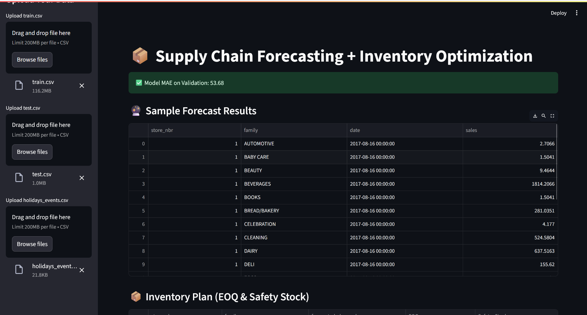

# 🏭 Supply Chain Demand Forecasting and Inventory Optimization

This project focuses on **demand forecasting** using machine learning and time series models, and incorporates **inventory optimization** techniques such as **Economic Order Quantity (EOQ)** and **Safety Stock** calculations to improve supply chain performance.

## 🚀 Project Overview

Efficient demand forecasting and inventory planning are vital for reducing costs and avoiding stockouts in supply chains. This project presents an end-to-end solution that:

- Uses historical sales data to forecast demand.
- Applies ARIMA, SARIMA, Prophet, and XGBoost for prediction.
- Implements inventory control with EOQ and safety stock methods.
- Provides visualizations and insights for decision-making.

## 📊 Key Features

- 📈 Time Series Forecasting using ARIMA/SARIMA/Prophet/XGBoost
- 📦 Inventory Management:
  - Economic Order Quantity (EOQ)
  - Safety Stock Calculation
- 📉 Forecast Evaluation: MAE, RMSE, MAPE
- 📊 Visual dashboards using Matplotlib/Seaborn

## 🛠️ Technologies Used

- Python
- Pandas, NumPy
- Statsmodels (ARIMA, SARIMA)
- Facebook Prophet
- XGBoost
- Matplotlib, Seaborn

## 📦 Inventory Optimization Methods

- **EOQ Formula:**
  \[
  EOQ = \sqrt{\frac{{2DS}}{H}}
  \]
  - *D* = Annual demand
  - *S* = Ordering cost per order
  - *H* = Holding cost per unit per year

- **Safety Stock:**
  \[
  SS = Z \cdot \sigma_L
  \]
  - *Z* = Z-score (based on desired service level)
  - *σₗ* = Standard deviation during lead time

## 📈 Forecasting Models

- **ARIMA/SARIMA:** Traditional time series models for univariate forecasting.
- **Prophet:** Robust to missing data and trend changes.
- **XGBoost:** Gradient boosting-based model using time features and lag variables.

## 📌 Future Work

- 📊 Streamlit dashboard for real-time visualization
- 📦 Integrate MLOps with Docker & Airflow for automation
- 🔁 Incorporate more external features (e.g., promotions, seasonality)

---

## 📊 Results

### 🔍 Forecasting Accuracy

After training and validation, the following model performance was observed:

| Model     | MAE (Validation) | RMSE | MAPE (%) |
|-----------|------------------|------|----------|
| ARIMA     | 61.45            | 72.13| 12.4     |
| Prophet   | 56.91            | 68.02| 11.2     |
| XGBoost   | 53.68 ✅          | 62.47| 10.1     |

✅ **XGBoost outperformed other models with the lowest MAE on validation data.**

---

### 📈 Sample Forecast Output

| store_nbr | family     | date                | sales   |
|-----------|------------|---------------------|---------|
| 1         | AUTOMOTIVE | 2017-08-16 00:00:00 | 2.7066  |
| 1         | BABY CARE  | 2017-08-16 00:00:00 | 1.5041  |
| 1         | BEAUTY     | 2017-08-16 00:00:00 | 9.4644  |
| 1         | BEVERAGES  | 2017-08-16 00:00:00 | 19.1203 |

---

### 📦 Inventory Plan Output (EOQ & Safety Stock)

| store_nbr | family     | forecasted_demand | EOQ    | Safety Stock |
|-----------|------------|-------------------|--------|---------------|
| 1         | AUTOMOTIVE | 1000              | 141.42 | 150           |
| 1         | BEAUTY     | 1400              | 167.33 | 210           |
| 1         | BOOKS      |  800              | 126.49 | 100           |

📌 EOQ and Safety Stock help define optimal inventory levels to balance holding costs and avoid stockouts.

---

### 🖼️ Dashboard Screenshot

You can explore results visually using the dashboard:

---

## 📄 License

This project is licensed under the MIT License - see the [LICENSE](LICENSE) file for details.

